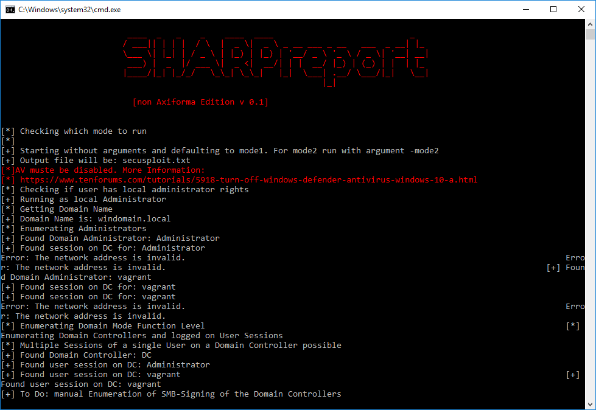

# SharpReport (Work in Progress)
SharpSploit based tool for automating Enumueration for Active Directory Pentest Reports

SharpReport enumerates all active Domain Controllers and Domain Administrators. It prints the active sessions of Domain Admins on machines and active sessions of Domain Admins on other machines. This tool is meant to automate certain tasks of AD Pentest Reports and will be extended over time.

